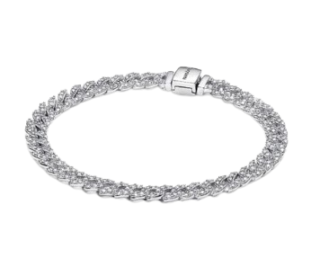

##  Team

| No  | Nama                | NRP        | Role |
| --- | ------------------- | ---------- | ---- |
| 1   | Kanafira Vanesha P. | 5027241010 | Hi-fi |
| 2   | Reza Aziz Simatupang   | 5027241051 | Lo-fi |
| 3   | Fika Arka Nuriyah     | 5027241071 | Hi-fi |

---

#  LUNEA JEWELRY - Hi-Fi Responsive Website

<div align="center">


**Shine In Your Story** ✨

A luxury jewelry e-commerce website with responsive design, modern UI, and full interactivity.

[Features](#-features) • [How to Run](#-how-to-run) • [Project Structure](#-project-structure) • [Team](#-team)

</div>

---

##  About LUNEA Jewelry

LUNEA adalah website e-commerce premium untuk perhiasan mewah yang menampilkan koleksi eksklusif dari perhiasan wanita berkualitas tinggi. Website ini dirancang dengan desain modern, elegan, dan responsif untuk memberikan pengalaman berbelanja luxury yang seamless di semua perangkat.

###  Target Market
- Wanita modern yang menghargai craftsmanship
- Pembeli perhiasan premium dan gifts
- Pelanggan yang mencari desain eksklusif

###  Brand Identity
- **Primary Color:** Rose Gold (#D54F9A)
- **Accent Color:** Blush Pink (#F2D7D8)
- **Typography:** Cormorant Garamond (serif) + Montserrat (sans-serif)
- **Style:** Luxury, modern, elegant

---

##  Features

###  Core Features
-  **8 Complete Sections**
  - Navigation Bar dengan smooth scroll
  - Hero Section dengan floating animations
  - 5 Product Categories (Bracelets, Rings, Necklaces, Earrings, Gifts)
  - 20 Featured Products dengan rating & pricing
  - Brand Story Section
  - Customer Testimonials
  - Newsletter Subscription
  - Footer dengan social links

-  **E-Commerce Functionality**
  -  Search Products
  -  Login & Register System
  -  Add to Cart / Shopping Bag
  -  Quick View Modal
  -  Product Ratings & Reviews

-  **Mobile-Friendly Design**
  - Responsive layout (Mobile, Tablet, Desktop)
  - Hamburger menu untuk mobile
  - Touch-friendly buttons
  - Optimal viewing di semua ukuran layar

-  **Interactive Elements**
  - Smooth animations & transitions
  - Intersection Observer untuk scroll effects
  - Form validation
  - Toast notifications
  - Modal dialogs

###  Design Highlights
- Luxury aesthetic dengan spacing & typography premium
- Smooth animations & micro-interactions
- Professional color scheme
- High-quality product imagery
- Clean & modern UI/UX

---

##  How to Run

###  Prerequisites
- Any modern web browser (Chrome, Firefox, Safari, Edge)
- No installation or build tools needed
- Works offline

### Method 1: Browser File Explorer 
```bash
1. Buka File Manager / Finder
2. Navigate ke folder: imk-lunea-web-hifi
3. Double-click: index.html
4. Website terbuka otomatis di browser 
```

### Method 2: Python HTTP Server 
```bash
# Buka terminal di folder imk-lunea-web-hifi
cd /path/to/imk-lunea-web-hifi

# Jalankan Python HTTP server
python3 -m http.server 8000

# Output: Serving HTTP on 0.0.0.0 port 8000 ...

# Buka browser: http://localhost:8000 
```

### Method 3: Live Server Extension (VSCode)
```bash
1. Install extension "Live Server" 
2. Right-click index.html di VSCode
3. Select "Open with Live Server"
4. Browser otomatis terbuka di http://localhost:5500 
```

### Method 4: Node.js HTTP Server
```bash
# Install http-server
npm install http-server

# Jalankan server
npx http-server

# Browser: http://localhost:8080 
```

---

##  Project Structure

```
imk-lunea-web-hifi/
│
├── index.html                    ← Main website file
├── README.md                     ← This file
├── SETUP.md                      ← Setup instructions
│
├── src/
│   ├── css/
│   │   └── styles-advanced.css   ← All styling (responsive, animations)
│   │
│   ├── js/
│   │   └── main-advanced.js      ← All interactivity (login, cart, etc)
│   │
│   └── assets/
│       └── images/
│           ├── logo.png          ← Brand logo
│           ├── bracelet.png      ← Bracelet products
│           ├── necklace.png      ← Necklace products
│           ├── ring.png          ← Ring products
│           └── earring.png       ← Earring products
│
└── index-v1.html                 ← Backup v1 file
```

---

##  Technology Stack

### Frontend
- **HTML5** - Semantic markup
- **CSS3** - Flexbox, Grid, Custom Properties, Animations
- **JavaScript (ES6+)** - Vanilla JS, no frameworks
- **Font Awesome 6.4.0** - Icons
- **Google Fonts** - Typography

### Architecture
- Mobile-first responsive design
- CSS Custom Properties (variables)
- Intersection Observer API
- LocalStorage untuk user data & cart
- No external dependencies!

---

##  Key Sections Explained

###  Navigation Bar
- LUNEA logo dengan branding
- Desktop navigation links
- Mobile hamburger menu
- Search, Profile, Cart buttons
- Sticky pada scroll

###  Hero Section
- Floating card animations
- Call-to-action button (SHOP NOW)
- Decorative elements
- Responsive spacing

###  Product Categories
- 5 category cards (Bracelets, Rings, Necklaces, Earrings, Gifts)
- Hover overlay effects
- Smooth navigation links

###  Featured Products
- 20 product cards (4 per category)
- Product image with quick view
- Price, rating, reviews
- Add to Bag functionality

###  Brand Story
- Two-column layout
- Brand narrative
- Luxury aesthetic

###  Testimonials
- 3 customer reviews
- 5-star ratings
- Social proof

###  Newsletter
- Email subscription form
- Input validation
- Success notification

###  Footer
- Company info links
- Customer service
- Social media links

---

##  User Authentication

### Login System
- Email & password form
- LocalStorage storage
- Demo: gunakan email/password apapun
- Auto-fill ke profile section

### Registration System
- Full name, email, password
- Password confirmation
- Form validation
- User account creation

### Profile Management
- View user info (name, email, member since)
- Loyalty points tracking
- Logout functionality

---

## 🛒 Shopping Features

### Cart Management
- Add products ke bag
- View cart items
- Remove items dari cart
- Total price calculation
- LocalStorage persistence

### Quick View
- Modal popup product details
- Product image, name, price
- Direct add to cart option

### Search
- Search modal dengan input
- Product filtering
- Scroll to collection

---

##  Customization

### Change Brand Colors
Edit `src/css/styles-advanced.css`:
```css
:root {
    --rose: #D54F9A;              /* Primary color */
    --rose-light: #F2D7D8;        /* Accent color */
    --beige: #E6D4C8;             /* Secondary */
    --charcoal: #2C2C2C;          /* Text color */
}
```

### Add New Products
Di `index.html`, temukan section `<!-- Bracelets Grid -->` dan copy product card:
```html
<div class="product-card">
    <div class="product-image">
        
        <div class="product-overlay">
            <button class="btn-overlay">Quick View</button>
        </div>
    </div>
    <h3>Product Name</h3>
    <p class="price">$XXX.00</p>
    <div class="rating"><!-- ratings --></div>
    <button class="btn-add">Add to Bag</button>
</div>
```

### Change Product Images
Ganti `src="src/assets/images/..."` dengan path ke image baru:
```html

```

### Change Text Content
Edit langsung di `index.html`:
```html
<h1>Your Title Here</h1>
<p>Your description here</p>
```

---

##  Responsive Breakpoints

| Device | Width | Layout |
|--------|-------|--------|
| Mobile | < 768px | Single column, hamburger menu |
| Tablet | 768-1024px | 2-column grid |
| Desktop | > 1024px | 3-4 column grid |

**Test Responsive:**
1. Buka F12 (Developer Tools)
2. Click device icon (top-left)
3. Select "Responsive Design Mode"
4. Test di berbagai ukuran!

---


##  Performance

- **Load Time:** < 2 seconds
- **Page Size:** Lightweight (optimized)
- **Image Optimization:** CDN + local assets
- **No External Dependencies:** Pure HTML/CSS/JS

---

##  Troubleshooting

### Images tidak tampil
```
Solusi:
1. Pastikan folder src/assets/images/ ada
2. Cek nama file gambar (case-sensitive)
3. Pastikan path benar: src/assets/images/nama-file.png
4. Refresh browser (Ctrl+Shift+R)
```

### Mobile menu tidak bekerja
```
Solusi:
1. Buka F12 > Console
2. Cek error messages
3. Pastikan main-advanced.js ter-load
4. Clear browser cache
```

### Logo tidak tampil
```
Solusi:
1. Pastikan logo.png ada di src/assets/images/
2. Cek path di index.html: src="src/assets/images/logo.png"
3. File harus .png format
```

---

##  Learning Outcomes

Project ini mengajarkan:

### HTML
- Semantic markup (`<nav>`, `<section>`, `<article>`)
- Accessibility attributes
- Form handling

### CSS
- CSS Grid & Flexbox
- CSS Custom Properties (variables)
- Media queries & responsive design
- Animations & transitions
- Modern layout techniques

### JavaScript
- DOM manipulation
- Event handling
- Form validation
- LocalStorage API
- Intersection Observer
- Modal management

---

##  Potential Enhancements

- [ ] Backend payment integration (Stripe, etc)
- [ ] Database untuk user & products
- [ ] Admin dashboard
- [ ] Product filtering & sorting
- [ ] Wishlist feature
- [ ] Product reviews submission
- [ ] Email notifications
- [ ] Social login (Google, Facebook)
- [ ] Analytics integration
